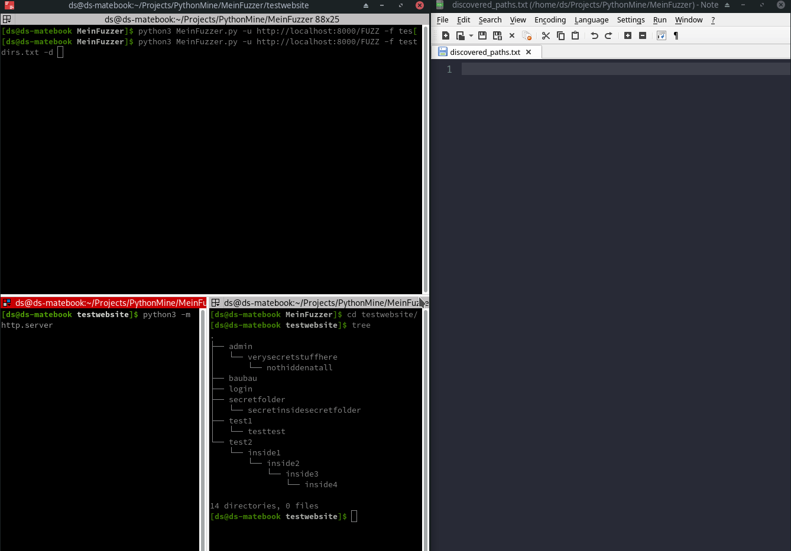
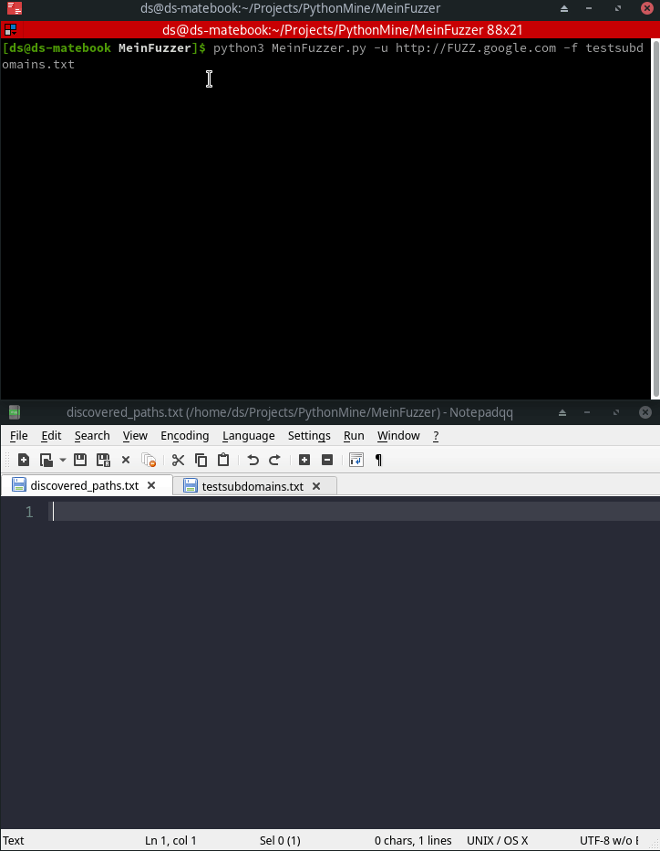

# MeinFuzzer
Fuzzing Tool

## Description:
### Fuzzing Tool
### At present only capable of subdomain, domain, directories, extensions fuzzing (GET requests)
### Works similar to Ffuf and Wfuzz
### Parameters:
1. "-u", "--url", "Target URL" (E.g. value https://FUZZ.google.com)
2. "-f", "--fuzzlist", "Fuzzing payload list" (E.g. value payloads.txt)
3. "-d", "--direnum", "Whether it is a directories enumeration or not" (Doesn't require a value)

### Directories enumeration with recursive fuzzing

###
